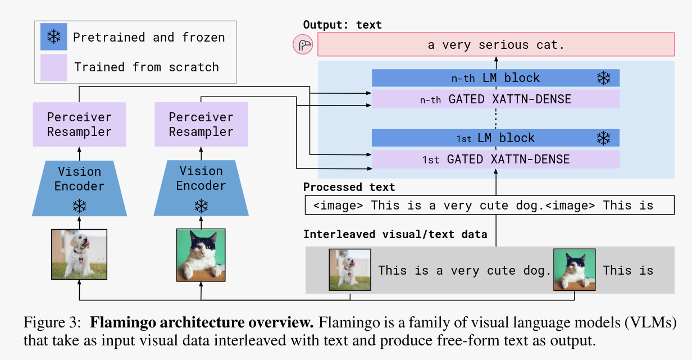

# Open Flamingo Serving


This repo contains the code to serve the [Open Flamingo](https://laion.ai/blog/open-flamingo/) model via gRPC in a containerized environment.

Under the hood it is using the [Jina](https://github.com/jina-ai/jina) framework as well as [DocArray v2](https://github.com/docarray/docarray/tree/feat-rewrite-v2#readme) for the data representation and serialization.

## What you can do with this repo:

* Serve [Open Flamingo](https://laion.ai/blog/open-flamingo/) via gRPC
* Serve with Docker with the containerized application
* Kubernetes deployment
* Cloud native features supported by [Jina](https://github.com/jina-ai/jina), namely:
  * [Replication](https://docs.jina.ai/concepts/flow/scale-out/)
  * Monitoring and tracing with the [OpenTelemetry](https://docs.jina.ai/cloud-nativeness/opentelemetry/) support
  * [Dynamic Batching](https://docs.jina.ai/concepts/executor/dynamic-batching/) for fast inference 

## How to use:

### 1. via Python

run 

```cmd
pip install -r requirements.txt
```

then start the server. You need to have at least 18gb of video of ram. Alternatively you can use your CPU (will be slow though) by changing the device parameters of the `FlamingoExecutor` to `cpu`

```cmd
python serve.py
```

This will expose the gRPC server on the port `12347`

you can connect via the client by running

```cmd
python client_example.py
```

### 2. via Docker

You need to have docker install in your machine with nvidia [driver support](https://docs.nvidia.com/datacenter/cloud-native/container-toolkit/install-guide.html) for docker
or to run via cpu as explain above

```cmd
cd open_flamingo_serve
docker build -t open_flamingo:latest .
```

then you can run it via

```cmd
 docker run open_flamingo:latest 
```

### 3. via Kubernetes

You will need to have a Kubernetes cluster setup and ready.

```cmd
kubectl apply -R k8s
``` 


### 4. Run on Jina AI Cloud

You can deploy this app on [Jina AI Cloud](https://cloud.jina.ai/) :

first

```cmd
pip install jcloud
```
then ( you will be asked to authenticate yourself first)
```
jc deploy flow.yml
```

## What is OpenFlamingo ?

[Open Flamingo](https://laion.ai/blog/open-flamingo/) is an open source implementation of the [Flamingo paper](https://arxiv.org/abs/2204.14198)
from Deepmind, created and trained by [LAION](https://laion.ai/).


`Flamingo` is one of the first `MLLM` (Multi Modal Large Language Model). This MLLM are LLM (Large Language Model) like GPT3 that are extended to work with modalities beyond text. In the case of Flamingo, it is able to understand both image text, 
unlocking several use-case of LLM like cross modal reasoning, Image understanding, In context Learning of with image, ... . We can see this OpenFlamingo as the first open source GPT4 Alternative

MLLM are a promising field of AI research, and as argued by Yann Lecun in this [blog post](https://www.noemamag.com/ai-and-the-limits-of-language/), extending AI models beyond text and natural language might be a requirement to build stronger AI.
he says:
```
An artificial intelligence system trained on words and sentences alone will never approximate human understanding
Y. LeCun
``` 

Several top AI labs have been working towards this direction of MLLM. Here is a non-exhaustive list of other MLLM work:

* GPT4 from OpenAI has been announced as being multi-modal (Vision + Text) but only the Text part is available as I write this readme.
* [BLIP2](https://arxiv.org/abs/2301.12597) from Saleforce Research. (This one is slightly different from Flamingo as it can take only one image as input)
* [Kosmos 1](https://arxiv.org/abs/2302.14045) from Microsoft Research
* and more ...


## How is Flamingo working ?

Flamingo models leverage pretrained frozen model for language and vision and "glue" them together. They basically teach a big, text only, LLM how to see by training an adapter to adapt embedding from a frozen vision feature extractor to the input of a LLM.
This process is called mutli modal fusion and is at the heart of modern Multi Modal AI research. You can think about it as translating image to text before feeding into a pretrained LLM but instead of translating at the token level (i,e, text level) the translation
happened via the adapter at the embedding space which is a higher lever of abstraction.


Specifically Flamingo is doing `early` fusion. The mutli modal interaction is done as soon as the first attention layer of the frozen pretrained LLM.



This is different from BLIP2 for instance where the fusion is done `later` in the last layers of the network.

## What is the difference between OpenFlamingo and Flamingo

OpenFlamingo is an open source reimplementation of the Flamingo paper by the [LAION](https://laion.ai/) people.

It is using LLama 7b from meta (which it was using flan family instead for licence reason) for the LLM backbone and ViT-L-14 from the open clip implementation.
They end up with a 9b Open flamingo model that was trained on  5M samples from our new Multimodal C4 dataset and 10M samples from LAION-2B.


## TODO


- [ ] add a toy frontend to play around


